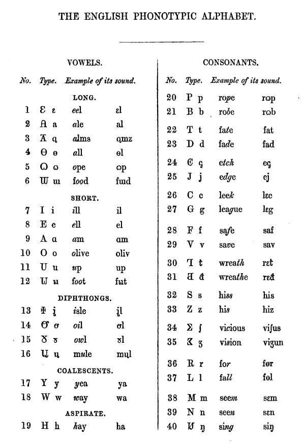

# On a Concensus on English Pronuntiation
The English is well known for phonetic-spelling discordance among European languages, so that an IPA notation is Jenerally required for a dictionary to pronounce words (also commun in overseas French dictionaries), which has been rising into concern of hundreds to thousands of millions of world English learners. In 1850, Isaac Pitman drew a table as beloe.

## Vocals
|[EPA](https://en.wikipedia.org/wiki/English_Phonotypic_alphabet)|Jeneral Estuary|Jeneral American|Jeneral Australian
|-|-|-|-
|/iː/|/iː/|/iː/|/ɪi/
|/eɪ̯/|/eɪ/|/eɪ/|/æɪ/
|/ɑː/|/ɑː/|/ɑː/|/ɑː/
|/ɔː/|/ɔː/|/ɔː/|/oː/
|/oʊ̯/|/əʊ/|/oʊ/|/əʉ/
|/uː/|/uː/|/uː/|/ʊu/
|/ɪ/|/ɪ/|/ɪ/|/ɪ/
|/ɛ/|/e/|/ɛ/|/e/
|/æ/|/æ/|/æ/|/æ/
|/ɒ/|/ɒ/|/ɑ/~/ɔ/|/ɔ/
|/ʌ/|/ɐ/|/ʌ/|/ɐ/
|/ʊ/|/ʊ/|/ʊ/|/ʊ/
|/aɪ̯/|/aɪ/|/aɪ/|/ɑe/
|/aʊ̯/|/aʊ/|/aʊ/|/æɔ/
|/ɪu̯/|/juː/|/juː/|/jɪɯ/
|/ɔɪ̯/|/ɔɪ/|/ɔɪ/|/oɪ/

Jeneral Estuary accent is accepted midway between "Receved Pronuntiation" of upper class and Cockney pronuntiation of loër class, proposed upon comparability with Jeneral American and Jeneral Australian accents for being class-inspecific.

The word _**receeved** pronuntiation_ implies that the British government has never been trying to subjectively define the standard pronuntiation of English in the United Kingdom or England; though it is sumtimes referred as "the King/Queen's English", the Kings and Queens has never exercised their power to regulate English, as one thereamong, [George I](https://en.wikipedia.org/wiki/George_I_of_Great_Britain) (28 May 1660 – 11 June 1727) lost moast of his powers due to incapability of speaking English, which is far from internassionality before Two World Wars in the 20th century. Allso, the so-called "Receeved Pronuntiation" is only practiced in 3% of population in England.

See [here](https://en.wikipedia.org/wiki/Sound_correspondences_between_English_accents) for more accents, [here](https://en.wikipedia.org/wiki/English_orthography) for a more comprehensive understanding.

Notes:
1. Isaac Pitman's English Phonotypic Alphabet and Dezzeret runes (created 1847) suggested then-Jeneral American Pronuntiation.
2. /ɜː/ was once reccognized as the allophone of /ʌ/ before /ɹ/ in the 19th century United States by some linguists.

## Consonants
Consonants Jenerally do not differ in accents. So we are givving a neutral table. Precisely, there are devoiced and voiced obstuënts, namely plosives, affricates, and fricatives.
|P/A -V|+V|F -V|+V|
|-|-|-|-
|/p/|/b/|/f/|/v/|
|||th /θ/|dh /ð/|
|/t/|/d/|/s/|/z/|
|ch /ʧ/|j /ʤ/|sh /ʃ/|zh /ʒ/|
|/k/|/ɡ/|kh /x/||

There are allso sonorants in English: voiced are /ɹ/, /l/, /m/, /n/, /ŋ/, /j/, and /w/, while devoiced are /hʷ/~/ʍ/ and /h/. 
The combinations /ts/, /dz/, /tɹ/, /dɹ/ may have affricative behaving.

## Bare pronountiation reform
These words are not reformed orthographically, but phonetically. Derivations not listed. Lax-tense pairs
|Words|Before|After
|-|-|-
|cement|ce-MENT|CE-ment
|indict|in-DITE|in-DICT
|police|po-LECE|PO-lice
